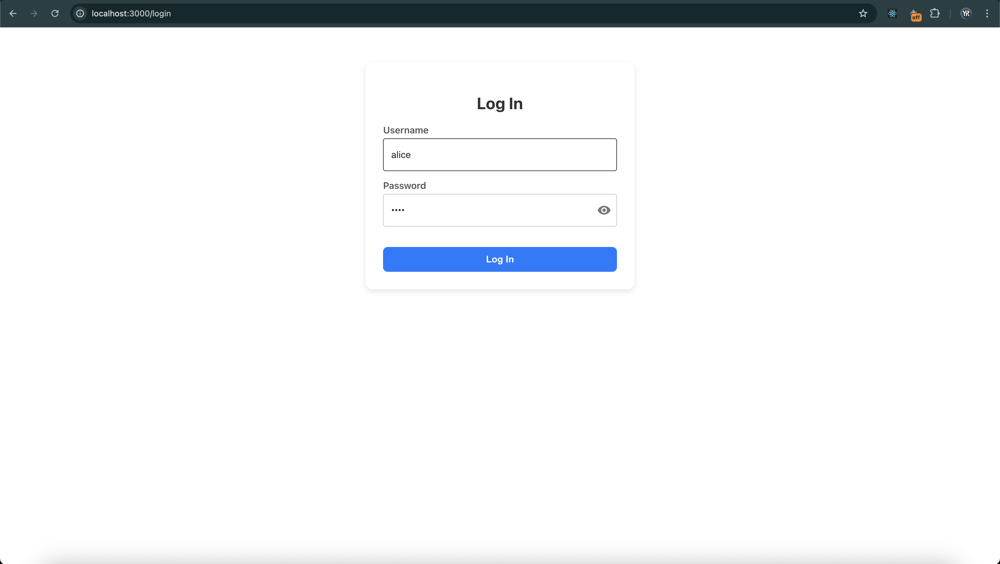
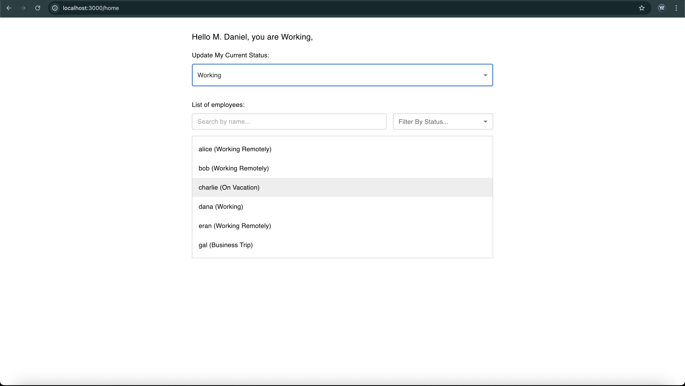

# 🧑‍💼 Status Board App

**Status Board App** is a full-stack web application for managing and displaying employee work statuses.  
The available statuses are:

- ✅ **Working**
- 🏡 **Working Remotely**
- 🌴 **On Vacation**
- ✈️ **Business Trip**

This project is containerized and orchestrated using **Docker Compose**, enabling seamless local development and testing.

---
## 📁 Project Structure

This project is composed of the following components:

- **Frontend**: React application for user login and status updates  
- **Backend**: FastAPI service providing authentication and API endpoints  
- **Database**: MongoDB for storing users and their statuses  
- **Seeder**: A one-time service that loads user data from a CSV file and inserts it into MongoDB on startup  

## 📷 UI Screenshots

Below are two screenshots demonstrating the main interface of the application:

### 🔐 Login Page


### 🏠 Home Page


---

## 🚀 Getting Started with Docker Compose

### 1. Clone the repository

```bash
git clone https://github.com/yuvalr55/StatusBoard.git
cd StatusBoard
```

### 2. Prerequisites

#### 🔧 For Docker-Based Setup (recommended)
Ensure the following are installed:
- [Docker](https://docs.docker.com/get-docker/)
- [Docker Compose](https://docs.docker.com/compose/install/)

#### 💻 For Local Development (without Docker)
To run backend or frontend locally (outside Docker), install:
- [Python 3.10+](https://www.python.org/downloads/) – for the FastAPI backend
- [Node.js (v18+ recommended)](https://nodejs.org/) – for the React frontend

### 3. Run the entire application

```bash
docker-compose up --build
```

This will:
- Start the MongoDB container
- Build and start the backend service
- Build and start the frontend service
- Run the mongo-seed service **once**, inserting the users from the CSV into the database and exiting automatically

---

## 🌐 Application Endpoints

- **Frontend** (UI): [http://localhost:3000](http://localhost:3000)
- **Backend API (Swagger docs)**: [http://localhost:8000/docs](http://localhost:8000/docs)

---

## 🧑‍💻 Seeding Users from CSV

### File Location
The file used for seeding is:

```
seed/input_users.csv
```

Each row in the CSV should contain:
- `username`
- `password` (in plain text)
- `status`

### Seeding Process

- When you run `docker-compose up`, the `mongo-seed` container runs the script `backend/seed_users.py`.
- The script reads the CSV file, hashes the passwords using `bcrypt`, and inserts the users into MongoDB.
- After the insertion, the container **exits automatically**.

If you want to re-run the seeding manually:

```bash
docker-compose up --build mongo-seed
```

This will again run the script `backend/seed_users.py` to insert users from the CSV.

---

## 🧪 Testing User Login

Once the application is running:
1. Open the browser at [http://localhost:3000](http://localhost:3000)
2. Use one of the users defined in `input_users.csv` with its original (plain-text) password

---

## 📝 Notes

- The `mongo-seed` container is ephemeral. It runs, inserts data, and stops by design.
- Ensure the MongoDB service is **up and ready** before `mongo-seed` tries to insert users. This is managed automatically by `depends_on` in `docker-compose.yml`.

---

© 2025 Yuval Rechtman
"# StatusBoard" 
